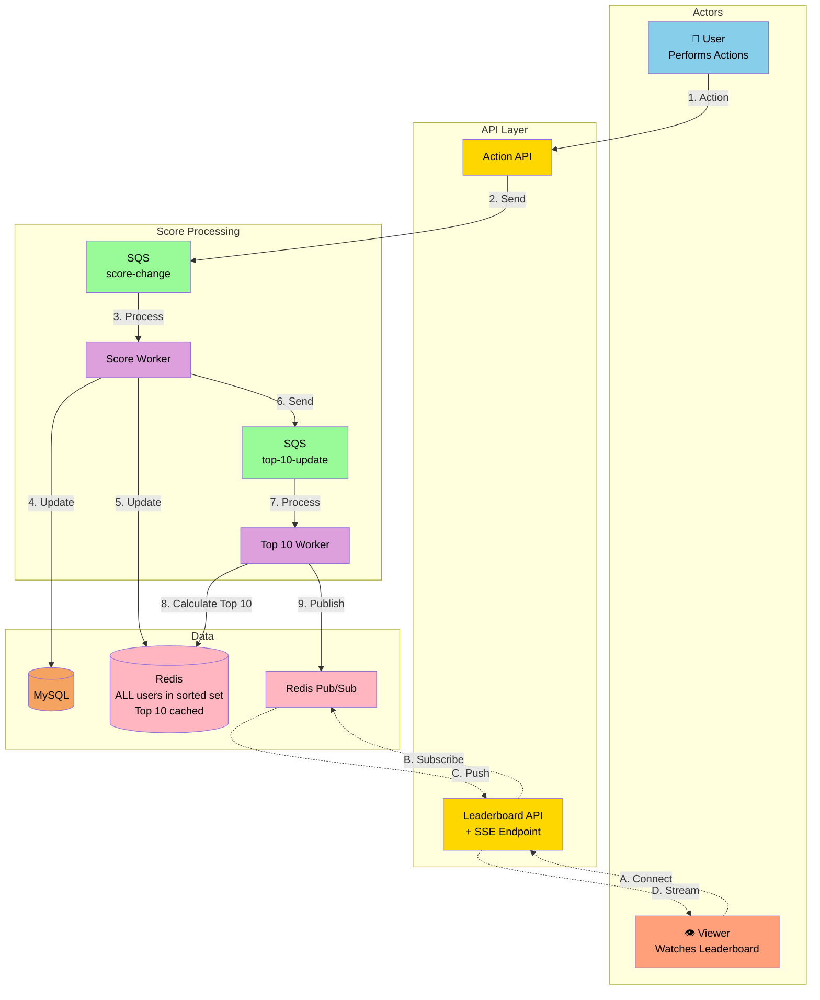
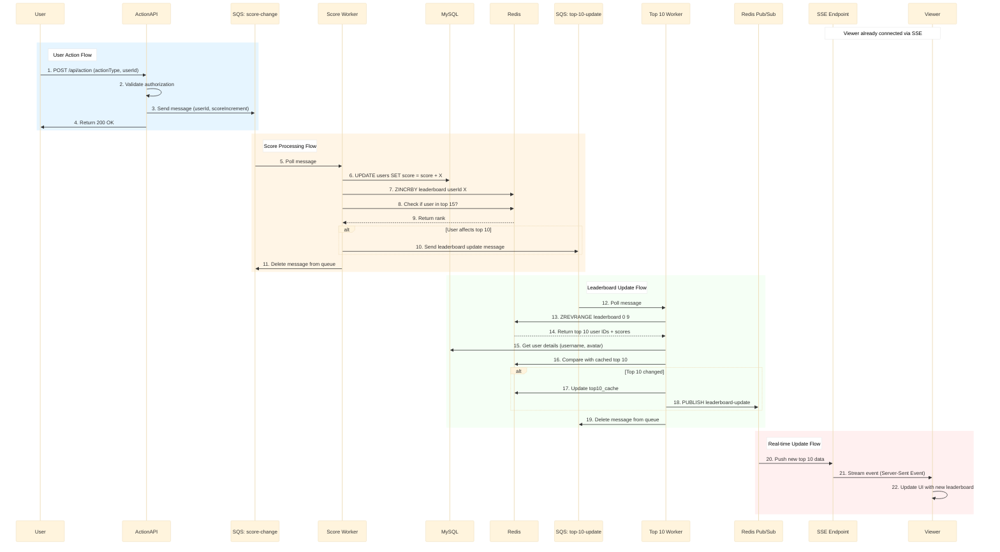

# Scoreboard System - API Service Specification

## Overview
Real-time leaderboard system that displays top 10 users based on their scores from completed actions.

## High-Level Architecture

## Execution Flow

## Key Components

### 1. Action API
- Receives user actions
- Validates authorization (prevents malicious score updates)
- Sends messages to SQS

### 2. Score Worker
- Processes score updates
- Updates user total score in database
- Updates Redis leaderboard (sorted set)
- Triggers top 10 recalculation if needed

### 3. Top 10 Worker
- Calculates top 10 from Redis
- Compares with cached version
- Only publishes if leaderboard changed
- Broadcasts via Redis Pub/Sub

### 4. SSE Endpoint
- Provides real-time updates to viewers
- Subscribes to Redis Pub/Sub
- Streams leaderboard changes to connected clients

## Data Storage

### Database (MySQL)
- `users` table: user_id, username, avatar, total_score
- `actions` table: action_id, user_id, action_type, score, timestamp

### Redis
- Sorted Set `leaderboard`: stores userId → score for fast ranking
- String `top10_cache`: cached JSON of current top 10
- Pub/Sub channel `leaderboard-update`: broadcasts changes

## Security Considerations
- Action API requires authentication (JWT)
- Validates user authorization before accepting actions
- Rate limiting to prevent abuse
- Idempotency keys for duplicate prevention

## Scalability
- Horizontal scaling of workers
- Redis for fast leaderboard queries (O(log N))
- SQS for reliable message processing
- Conditional updates (only broadcast when top 10 changes)

## Improvements for Future
- Add rate limiting per user
- Implement action validation rules
- Add monitoring and alerting
- Consider batch processing for high volume